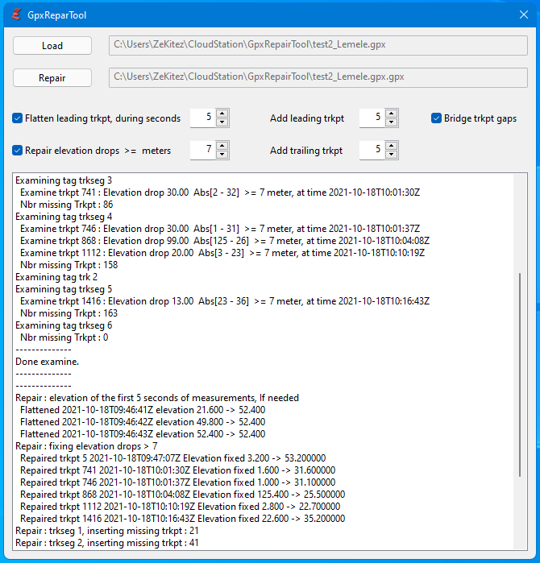
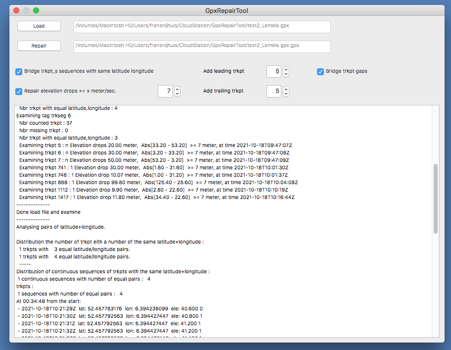

# Table of contents

- [Table of contents](#table-of-contents)
- [Introduction](#introduction)
- [References](#references)
- [How hard can it be to repair a .fit file ?](#how-hard-can-it-be-to-repair-a-fit-file-)
- [Run on Windows](#run-on-windows)
- [Run on Linux](#run-on-linux)
- [Run on MacOs (Intel/Amd only)](#run-on-macos-intelamd-only)

# Introduction

I started making videos with a GoPro Hero 9 and uploaded them in KinoMap but sometimes "My video isn't available in Kinomap apps, why ?". Read [https://support.kinomap.com/hc/en-us/articles/360000294886-My-video-isn-t-available-in-Kinomap-apps-why-](https://support.kinomap.com/hc/en-us/articles/360000294886-My-video-isn-t-available-in-Kinomap-apps-why-) . One reason is missing in the list: **The GPS data is not good enough**. The GPS data is extracted with GoPro Telemetry Extractor (Lite and free) from the GoPro video. Load this data in GpsTrackEditor and you will see that latitude+longitude are inaccurate and the elevation... is from another planet. I started to record GPS data with a Garmin Edge 830. KinoMap can handle the Garmin GPS data (.fit file). But sometimes the problem persisted:  "My video isn't available in Kinomap apps, why ?". Later I realized the problem with the Garmin GPS recording happens only in dense forest sections where it is still humid and the trees are wet from the rain. Thus the Garmin had bad signal reception !! This does NOT apply to the GoPro GPS data: its just always... not good enough.

The recording procedure is always the same: first start the GPS recording with the Garmin and after a few seconds start the video recording with the GoPro. And to stop : first stop the video recording and after a few seconds stop the GPS recording. This way there is always overlap of GPS measurements for the video which should result in a more easy synchronissation of video and GPS data in Kinomap.

The Garmin .fit file is a binary file (not readable with a text editor) and contains GPS measurements at maximal 1 second intervals (minimum data: latitude, longitude, time and elevation). If your Garmin is paired with other sensors (examples: cadans, heartrate or an.. ebike) then the measurements of these sensors are also included in the .fit file. More information about .fit files can be found at Garmin's website. The Garmin Edge can record smart or at 1 sec. intervals, see the manual on how to change that.

Sometimes, in Kinomap, synchronisation of video and GPS data was difficult or Kinomap rejected the .fit file or it showed in the app flattened (no elevations) or it was not available in the app. I searched for a tool to check the .fit file and found a very nice analyses tool (freeware) in the Windows Store:"Fit File Tools". The tool analyses the loaded .fit file and reports what is wrong in the file. Select menu "Fit File" and then item "Records". The tool can represent the data in graphs and in a map. Editing data is not available in the freeware version. Using this tool I found:

* elevation (altitude or enhancedAltitude) drops, suddenly the elevation drops/raises a number of meters ( > 10 meter). Reported as "Unexpexted big height change". I found them almost always at the start of the .fit file and very rarely, somewhere within the file.
* while the latitude and longitude do not change, the elevation and time stamp change. Reported as  "speed 0 but altitude changes". Only found a few.
* measurement gaps. The GPS device did not record at a 1 second rate but smart. This is not an error but a recording-optimalisation. Check the manual of your GPS.

Later with my own software, and another tool GpsTrackEditor, I discovered that a recording which was made in a wet dense forest but without me stopping/pauzing/halting had many 1-3 second stops (speed 0) :

* sequences of [2 .. 8] trkpts with identical/equal latitude+longitude, see above "while the latitude and longitude do not change.."

# References

* AllTrails https://www.alltrails.com but requires you to login to an, free, account
* "Fit File Tools"  https://www.microsoft.com/en-us/p/fit-file-tools/9nj8rzgjnxdf?activetab=pivot:overviewtab or https://en.gps-studio.com/
* Garmin Edge 830 Manual with smart or 1 second recording https://www8.garmin.com/manuals/webhelp/edge830/EN-US/GUID-5BF2156B-9740-47F1-A564-FA22D55FDEB1.html
* Garmin FIT files https://developer.garmin.com/fit/overview/
* GoPro Telemetry Extractor (lite) https://goprotelemetryextractor.com/free/
* GpsBabel https://www.gpsbabel.org/ or https://github.com/gpsbabel/gpsbabel
* GpsTrackEditor http://www.gpstrackeditor.com/
* GpxStudio https://gpx.studio/
* GPX format https://en.wikipedia.org/wiki/GPS_Exchange_Format and https://www.topografix.com/gpx.asp
* GoToes.org or Strava https://gotoes.org/strava/
* LossLessCut, for already merged GoPro videos, https://github.com/mifi/lossless-cut
* VeleHero, to analyse and display data, https://app.velohero.com but requires you to login to an, free, account
* WinMerge, to compare text files, https://winmerge.org/

# How hard can it be to repair a .fit file ?

On the Garmin website you can find conversion tools and code but after some experimenting, a simple forward-back conversion to .csv and back to .fit, with the FitCvsTool the results where poor (even crashes). The same applies to some online tools I found.

Kinomap accepts .gpx files so if the .fit file is translated to .gpx then I am free to repair the data (very simple: with an editor). There are freeware tools that can translate GPS formats into other GPS formats, I used: GpsBabel. GpsBabel will also display the .fit file in a map. Translating a .gpx file back to a .fit file failed. I had only crashes or bad .fit files. I assume the .gpx file misses information required for a .fit file.
There are also on line tools you could use, examples: Gotoes utilities for Strava (reduces the decimal part of latitude and longitude to 5 decimals compared to 9 with GpsBabel) or AllTrails (compared to what GpsBabel: the elevations differ up to 10 meter, the elevation has no decimal part, it doesn't include extensions (sensor data, cadans, temperature, etc) ). To view the repaired .gpx file on a map I use the tools: GpxStudio, GpsTrackEditor and VeloHero. To compare the original and repaired .gpx file I use WinMerge.

Thus the way to go is simple: use GpsBabel to convert the .fit file into a .gpx file and then run my own tool to repair the .gpx file. I wrote a program, in Purebasic, that repairs the .gpx file for me. Why PureBasic ? Its easy to program, has a build-in XML parser and functions to manipulate XML (move, delete, insert, etc), runs on Windows + Linux + MacOs, and I already had a license and used it for other tools.

The program does :

* load the .gpx file and examines what is wrong with the measurements (multiple identical latitude+longitude pairs, elevation drops and gaps).
* Repair the .gpx file and store it. Repairing means:

  * Fix faulty leading elevation measurements for the first n seconds of measurements.
    While the Garmin has a lock on the GPS signal for some unknown reason the start of GPS measurements in the recording shows elevations which are increasing while remaining at or almost at the same GPS location. A bypass is to record a few minuts on the parking lot before starting the real recording.
  * Repair elevation drops based on a specified minimal drop limit in meters/second.
    Within the recorded measurements some elevations are faulty and show a sudden drop/increase in meters. Could this be due to bad receiption of the GPS signal (mountains, forest, wet trees, etc) ?
  * Bridge the sequences of [2 .. n] trkpts with identical latitude+longitude, excluding every first of the identical latitude+longitude. This means calculating a new latitude+longitude at its time stamp.
  * Fill in (bridge) the measurement gaps.
    Although this is not wrong it just is nicer to fill in the measurement gaps with a measurements that bridge the gap in time, latitude, longitude and elevation. I found these gaps sometimes directly in the begin of the .gpx file and that made synchronising the video with the .gpx file, in Kinomap, more difficult. Note: this may be solved with the correct Edge setting.
  * Add a number of leading measurements.
    This is not really needed if the start procedure was executed correctly but it can make synchronising video and .gpx file much easier in Kinomap with more leading measurements (or synchronissation points for the video).
  * Flatten the leading measerements with the same latitude+longitude
  * Add a number of trailing measurements.
    This is not really needed if the stop procedure was executed correctly but it extends the .gpx file so it will fit over the video recording.

# Run on Windows

its a 64 bit version. No further actions required.

# Run on Linux

Its a 64 bit version. You may have to install several packages before the program runs. See:
http://forums.purebasic.com/english/viewtopic.php?f=15&t=74875 . This can be a real challenge if you are not familiar with Linux. The Purebasic IDE still crashes when I try to run the app but the compiled app works fine.

# Run on MacOs (Intel/Amd only)

Its a 64 bit Intel/AMD version (M1 excluded). No further actions needed.

